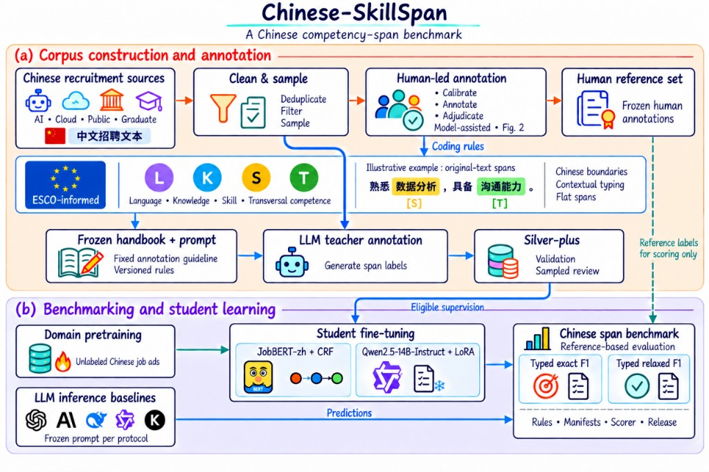

# Chinese-SkillSpan

**Chinese-SkillSpan** is a benchmark for competency span extraction from Chinese job advertisements. **JobBERT-zh** is the accompanying Chinese job-domain encoder used as a reproducible baseline.

Manuscript under review at **PeerJ Computer Science** (single-anonymized review: reviewers see author names). The source manuscript is maintained on Overleaf; this repository does not host a draft PDF.



Draft overview: (a) corpus construction and annotation; (b) domain pretraining, student fine-tuning, and scoring. This figure is a working sketch, not a camera-ready plate.

| Resource | URL |
|---|---|
| Code and data | https://github.com/AlfredJamesLi/chinese-skillspan-benchmark |
| Current archive (`v0.1.3`, includes the human reference set) | https://doi.org/10.5281/zenodo.22698504 |
| Previous snapshot (`v0.1.2`) | https://doi.org/10.5281/zenodo.22685143 |
| First snapshot (`v0.1.1`) | https://doi.org/10.5281/zenodo.22288338 |
| Concept DOI | https://doi.org/10.5281/zenodo.22288337 |
| JobBERT-zh v6a (current student; human-reference B2) | https://huggingface.co/AlfredJames/jobbert-zh-v6a |
| JobBERT-zh (3M DAPT + historical V4 CRF) | https://huggingface.co/AlfredJames/jobbert-zh |
| JobBERT-zh 1M (DAPT contrast) | https://huggingface.co/AlfredJames/jobbert-zh-1m |

Do not send reviewers through a Google Sites or Drive page. There is no separate Hugging Face dataset repository. Hugging Face user `AlfredJames` is not the GitHub user `AlfredJamesLi`. The 150-sentence **human reference set** (`data/gold150_test.jsonl`) is in GitHub Release / Zenodo **`v0.1.3`**, not in `v0.1.1` or `v0.1.2`.

**Current evaluation (0911 manuscript).** JobBERT-zh v6a B2 typed exact **0.5536±0.0054** (n=3 sample SD) on the human reference set. Teacher Silver-plus B2 (`v6a_nocross`, released **2,150 / 169**) trains the student; the human reference scores it. Do not call Silver-plus extra human-reference gold.

**Derived / historical protocol.** JobBERT-zh 3M typed exact **0.4331** (relaxed **0.5873**) on V4 hybrid **2,601** + jieba. That file is SOP-CWS + SimHuman, not the human reference freeze. Do not rank **0.5536** against **0.4331** in one SOTA sentence: different labels, *n*, and decode.

---

## Task

Each record is one sentence from a Chinese recruitment notice. The model must recover **flat, non-overlapping** character spans in four types (LSKT):

| Tag | Meaning |
|---|---|
| L | Language skills and knowledge |
| K | Knowledge |
| S | Occupational skills |
| T | Transversal skills and competences |

The inventory is ESCO-derived at the **type** level. This release does **not** include ESCO concept IDs.

**Primary metric:** typed exact-span micro-F1 (`cnss-lskt-1.2.0`, identifier-strict). Relaxed F1 uses IoU ≥ 0.5.

---

## Corpus

**22,840 sentences** from four Chinese recruitment sources. The corpus split (Table 1) is:

| Split | Sentences |
|---|---:|
| train | 17,460 |
| development | 2,143 |
| test | 3,237 |
| **Total** | **22,840** |

A later draft assignment (`repartition_v1`: 16,350 / 2,268 / 4,222) sums to the same *N* and is **not** the main gold.

Evaluation uses **versioned layers**. Pick the layer that matches the research question; do not pick a version because its model score is higher.

| Layer | File | Role (0911 manuscript) | Headline typed exact F1 |
|---|---|---|---|
| **Human reference set (current eval)** | `data/gold150_test.jsonl` (150 = challenge + calibration) | Frozen human scoring labels | JobBERT-zh v6a B2 **0.5536±0.0054** (n=3 sample SD); relaxed **0.6890±0.0085** |
| **Silver-plus B2 (teacher)** | `data/silver_plus_v6a_nocross/` | Student training, not extra human-reference gold | released **2,150 / 169** (PDF v6a row also cites an earlier **2,156** count) |
| **V4 hybrid 2,601 (derived / historical)** | `data/test_lskt_v4_cws_simhuman980_hybrid.jsonl` | SOP-CWS + SimHuman on the same ID pool; not the human freeze | JobBERT-zh 3M + jieba **0.4331** (relaxed **0.5873**) |
| **Shared-guidelines LLM (appendix)** | [`tables/gold150_shared_guidelines_rev2_patch1.csv`](tables/gold150_shared_guidelines_rev2_patch1.csv) | Frozen shared guidelines on the human reference set; not V4 main | gpt-5.6-terra **0.6667**; DeepSeek nothink **0.6469**; Qwen SFT **0.5403±0.0354** ([`tables/gold150_shared_guidelines_qwen_sft.csv`](tables/gold150_shared_guidelines_qwen_sft.csv)) |
| **SOP extract on 2,601** | [`tables/sop_extract_p2_2601.csv`](tables/sop_extract_p2_2601.csv) | Standardized zero-shot / Instruct SOP | gpt-5.4 **0.2132**; Qwen2.5-14B **0.1724**; Llama-3-8B **0.0582** |
| **Gold v2 / Handbook A** | `data/gold_canonical_v2.jsonl` | Construction history / appendix | ChatGPT (`gpt-4o` dump) **0.6365** |

Human-reference IDs sit inside the 2,601 pool; the **label files differ**. A frozen `gpt-4o` dump + jieba on the V4 hybrid is **0.2854** exact / **0.6249** relaxed — not the SOP table and not the human-reference cell. Do **not** rank shared-guidelines gpt-5.6-terra **0.6667** (or Qwen SFT **0.5403**) against v6a **0.5536** or V4 **0.4331**.

The V4 hybrid is **derived** (980 SimHuman rule_v4 + 1,621 SOP-CWS). Do not overwrite `gold_canonical_v2.jsonl` or the hybrid freeze.

The historical first **200**-sentence analysis (`data/human_gold_page1_200.jsonl`) is **not** the human reference set. Checksums: [REPRODUCIBILITY.md](REPRODUCIBILITY.md). Names and file map: [`data/gold150/README.md`](data/gold150/README.md). Provenance: [DATA_AVAILABILITY.md](DATA_AVAILABILITY.md), [`notes/SILVER_PLUS_EXTENSION_PROVENANCE.md`](notes/SILVER_PLUS_EXTENSION_PROVENANCE.md). A Handbook-B diagnostic (gold85 + IAA-50) lives in [`reports/human_gold85_iaa50/`](reports/human_gold85_iaa50/README.md); it does not replace the 150-sentence freeze.

---

## Human reference set and Silver-plus (current manuscript eval)

The 0911 PeerJ draft names the frozen 150-sentence evaluation **human reference set** (challenge cohort + calibration cohort). Laboratory identifier **Gold150** and filename `gold150_test.jsonl` stay in Appendix D / this repository. JobBERT-zh has **no prompt**; Qwen2.5-14B JSON-offset LoRA uses a fixed instruction and **no** demonstrations. Draft methods: [`docs/paper_body_silver_plus.md`](docs/paper_body_silver_plus.md).

On that freeze, the designated JobBERT student is v6a B2 **0.5536±0.0054**. JSON-offset Qwen **0.1215±0.0092** is a supplement (not shared-handbook SFT **0.5403±0.0354**, not SOP extract **0.1724**). P1 / peel rows do not replace the v6a B2 cell. B1 vs B2 on the **same** 150 sentences is the matched-text handbook contrast (v6a B1 **0.1422±0.0138**).

## Quick start

```bash
python3 -m pip install -r requirements-repro.txt
python3 scorer/test_regression.py
```

### Current evaluation (human reference set)

The freeze uses `source_id` and Doccano type names. Convert to BIO, then score character-level predictions with `cnss-lskt-1.2.0` (**no jieba**). Do not overwrite `data/gold150_test.jsonl`.

```bash
python3 scripts/convert_gold150_to_bio.py
python3 scorer/score_lskt.py \
  --gold data/gold150_test.bio.jsonl \
  --pred path/to/human_reference_predictions.jsonl \
  --align-mode official
```

`data/gold150_test.bio.jsonl` is derived and gitignored. The published JobBERT cell is Hub [`AlfredJames/jobbert-zh-v6a`](https://huggingface.co/AlfredJames/jobbert-zh-v6a): three-seed mean typed exact **0.5536±0.0054**. This clone does not ship frozen v6a test dumps that reprint that mean. Default Hub `crf/best.pt` is seed 42, not the mean.

JSON-offset Qwen (**0.1215±0.0092**) is a supplement (not shared-handbook SFT **0.5403±0.0354**, not SOP extract **0.1724**, not v6a **0.5536**):

```bash
python3 scripts/test_qwen_ext_parser.py
python3 scripts/eval_gold150_ext.py \
  --protocol json_offset \
  --pred path/to/gold150_predictions.jsonl \
  --out output/gold150_score.json
```

Qwen LoRA adapters are not in this release.

### Derived / historical protocol (V4 hybrid 2,601)

`--paper-main-only` is the **historical 2,601 encoder** command (flag name kept). The eval script is **read-only** on the hybrid gold (SHA-256 `2ad6342d…`). Expect JobBERT_3M_v4 typed exact **0.433118** (paper **0.4331**) after jieba:

```bash
python3 scripts/eval_hybrid_cws_simhuman.py --paper-main-only --use-frozen
```

When `output/` is absent, or with `--use-frozen`, that row comes from `data/frozen_preds/jobbert_3m_v4.jsonl`. Scoring those preds **without** jieba yields **0.2552** and is not the 2,601 headline. This command does not score the human reference set and does not print the SOP LLM table.

**SOP LLM table (committed cells; no API recall).** Print the 2,601-ID rows from [`tables/sop_extract_p2_2601.csv`](tables/sop_extract_p2_2601.csv):

```bash
python3 -c "
import csv
from pathlib import Path
with Path('tables/sop_extract_p2_2601.csv').open(encoding='utf-8', newline='') as f:
    for row in csv.DictReader(f):
        if row['split'] == 'P2_hybrid_2601' and 'SOP extract' in row['system']:
            print(row['system'], row['typed_exact_f1'], row['typed_relaxed_f1'])
"
```

Those cells include gpt-5.4 **0.2132** / **0.4199** and Qwen2.5-14B Instruct SOP **0.1724** / **0.3279**. This clone does not re-call those APIs. Omit the `SOP extract` filter (keep `P2_hybrid_2601`) to see every 2,601-ID row, including the frozen `gpt-4o` dump.

CRF training uses `requirements-train.txt` (see [REPRODUCIBILITY.md](REPRODUCIBILITY.md) §7). `--smoke` checks that the trainer loads; it is not a paper F1. An independent second-host check (2026-09-11, git `09897d9`, jieba 0.42.1) matched JobBERT 3M **0.433118** on the historical 2,601 protocol and left both freeze SHA-256 values unchanged. That host also scored the frozen `gpt-4o` dump (**0.285361** / **0.624869**); those dump cells are not the 0911 SOP table.

Weights are not stored in Git. Current student (0.5536±0.0054): https://huggingface.co/AlfredJames/jobbert-zh-v6a. Historical V4 CRF (0.4331): https://huggingface.co/AlfredJames/jobbert-zh.

---

## Repository layout

```
README.md
REPRODUCIBILITY.md
DATA_AVAILABILITY.md
LICENSE                   # proposed: Apache-2.0 (software) + data notice
CITATION.cff
CHANGELOG.md
CONTRIBUTING.md
requirements-repro.txt
requirements-train.txt
scorer/                 # cnss-lskt-1.2.0
scripts/
data/
  corpus_splits/        # train / dev / test (22,840)
  gold_canonical_v2.jsonl
  test_lskt_v4_cws_simhuman980_hybrid.jsonl
  train_lskt_v4_silver.jsonl
  dev_lskt_v4_silver.jsonl
  frozen_preds/
  human_gold_page1_200.jsonl
  gold150_test.jsonl    # human reference set (artifact Gold150); Zenodo v0.1.3
  silver_plus_v6a_nocross/
docs/                   # manuscript-body drafts
notes/handbooks/        # Handbook B (paper SOP; v4.2.14)
figures/fig_pipeline_overview.jpg
tables/                 # includes sop_extract_p2_2601.csv (0911 LLM table)
release/                # Hugging Face and Zenodo templates
```

---

## Citation

```bibtex
@misc{li2026chineseskillspan,
  title        = {Chinese-SkillSpan: A Benchmark for Competency Span Extraction from Chinese Job Advertisements},
  author       = {Li, Guojing and Fu, Zichuan and Li, Junyi and Zhang, Wenlin and Guo, Kaifeng and Yang, Jinning and Gao, Jingtong and Zhao, Xiangyu},
  year         = {2026},
  howpublished = {Zenodo},
  doi          = {10.5281/zenodo.22698504},
  url          = {https://github.com/AlfredJamesLi/chinese-skillspan-benchmark}
}
```

Related English dataset (cite, do not host the PDF here): Zhang et al., 2022, *SkillSpan: Hard and Soft Skill Extraction from English Job Postings*, NAACL-HLT, https://aclanthology.org/2022.naacl-main.366/.

Machine-readable metadata: [`CITATION.cff`](CITATION.cff).

**Authors (order fixed).** Guojing Li<sup>1,2,†</sup>, Zichuan Fu<sup>2,†</sup>, Junyi Li<sup>2</sup>, Wenlin Zhang<sup>2</sup>, Kaifeng Guo<sup>2</sup>, Jinning Yang<sup>2</sup>, Jingtong Gao<sup>2</sup>, Xiangyu Zhao<sup>2</sup>.

1. Renmin University of China  
2. City University of Hong Kong  
† Equal contribution.

Corresponding author: Xiangyu Zhao (`xianzhao@cityu.edu.hk`).

---

## Licence

A proposed split notice is in [`LICENSE`](LICENSE): **Apache-2.0** for the official scorer, clone-relative scripts, and original documentation; **not CC-BY** for job-advertisement wording. Corresponding author confirmation is still required. JobBERT-zh remains `other` on Hugging Face until text rights are confirmed. A Zenodo GitHub hook may label a record `cc-by-4.0` by platform default; that is not this grant. See [DATA_AVAILABILITY.md](DATA_AVAILABILITY.md).

---

## Limitations

- Labels are flat and non-overlapping. Nested or crossing spans are out of scope.
- The current evaluation is a frozen 150-sentence human reference set, not a random draw from all 3,237 test sentences.
- The V4 hybrid 2,601 file is a derived / historical protocol, not a completed human Doccano gold.
- Job advertisements can contain employer names and workplace locations. Do not scrape, republish, or re-identify individuals.
- Domain shift across the four sources is large.
- Do not use the resource to profile applicants, infer protected attributes, or claim ESCO concept-ID accuracy.

---

## Acknowledgements

This work was supported by the National Social Science Fund of China, Grant No. **21BGL142**.
