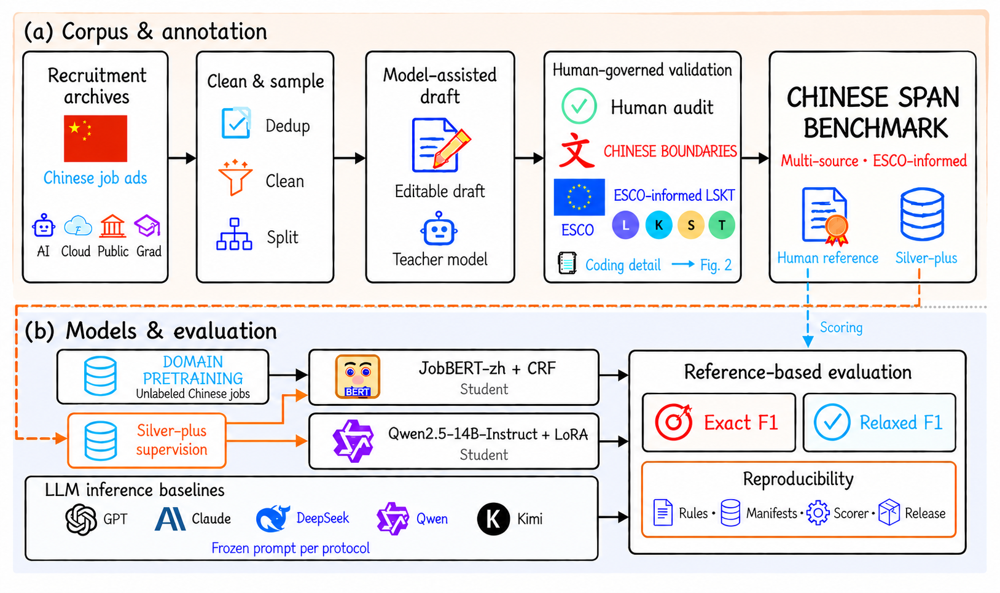

# Chinese-SkillSpan

Chinese-SkillSpan is a benchmark for competency span extraction from Chinese job advertisements. It combines an operational Chinese annotation guide, a frozen human reference, teacher supervision and companion evaluation studies. The manuscript is under review at PeerJ Computer Science; its source is maintained on Overleaf. This repository does not host a draft PDF.

**13 September 2026 paper alignment:** [paper/companion index](reproduction/PAPER_INDEX.md) · [reproduction entry](REPRODUCIBILITY.md) · [names and original identifiers](PAPER_NAMES.md) · [Round 2 changes](reproduction/ROUND2_CHANGES.md).



The author-selected workflow distinguishes corpus/annotation and model/evaluation stages. See [final figure assets](figures/round2/README.md).

## Resource and current results

| Layer | Scope | Purpose |
|---|---|---|
| Original corpus | 22,840 sentences; original split 17,460/2,143/3,237 | Four recruitment collections; corpus annotations are not 22,840 current human gold sentences |
| Human reference | 150 sentences, 663 spans; 50 calibration + 100 challenge | Frozen evaluation targets, separately adjudicated |
| Silver-plus pool | 2,451 teacher-supervision records | Initial review and later teacher annotation; manifest-specific admission |
| Qwen B2 supervision | 2,150 train / 169 dev | Released teacher labels for the matched adaptation study |
| Primary JobBERT comparison | 2,156 train / 169 dev | Matched B1/B2 texts, different training/development labels |

| Current comparison | Typed exact micro-F1 |
|---|---:|
| Qwen without adapter | 0.3612 |
| Qwen B2 LoRA | 0.5403 ± 0.0354 |
| JobBERT earlier labels (B1) | 0.1422 ± 0.0138 |
| JobBERT revised labels (B2) | 0.5536 ± 0.0054 |

Student summaries use seeds 42/43/44 and sample SD. Qwen compares adaptation under a fixed inference protocol; JobBERT compares supervision and development-based checkpoint selection. Six shared-guideline inference configurations now appear in the paper's main Table 5; [their values](reproduction/current_results/inference.csv) and [Qwen per-seed values](reproduction/current_results/qwen_runs.csv) are available separately. The human reference was used during guideline development; it is not a newly collected blind test.

## Task and materials

Recover flat character spans with types L (language), K (knowledge), S (occupational skills), and T (transversal competences). The inventory is ESCO-informed at type level; it does not assign ESCO concept IDs. Typed exact F1 is primary; relaxed F1 permits same-type span overlap at IoU >= 0.5.

- [Human reference and names](data/gold150/README.md)
- [Released Qwen supervision](data/silver_plus_v6a_nocross/README.md)
- [Current Chinese handbook](notes/handbooks/handbook_B_sop_v4.md)
- [Seven transferred supplementary tables](reproduction/supplementary_tables/README.md)
- [Detailed output outcomes](reproduction/output_outcomes/README.md)
- [Qwen diagnostic figure data](reproduction/qwen_diagnostics/README.md)
- [Coding agreement](reproduction/agreement/README.md)
- [Experimental notes and 81 passage mappings](reproduction/experimental_notes/README.md)
- [Earlier historical results](reproduction/historical_results/README.md)

The full model names and recorded API/file identifiers remain in [PAPER_NAMES.md](PAPER_NAMES.md). DeepSeek non-thinking and thinking are distinct configurations of the same recorded model. GPT proxy is a display name for the recorded proxy configuration, not independent verification of provider routing.

## Reproduction

Start with [REPRODUCIBILITY.md](REPRODUCIBILITY.md). The current entry separates reading committed results, scoring compatible frozen predictions, and rerunning inference/training. The [file inventory](reproduction/evaluation/materials_inventory.json) distinguishes files actually found in the public tree from local revision evidence. Qwen adapters and some historical implementation bindings remain unavailable.

```bash
python reproduction/verify_companion.py
```

This checks the companion package without model calls or rescoring. Existing historical commands and their complete context are preserved in [the 0911 reproduction guide](docs/archive/REPRODUCIBILITY_0911.md); command names containing `paper-main` there refer to the earlier 2,601-record study. Frozen data, predictions and scorer files retain their original paths and contents.

## Public access

| Resource | Link |
|---|---|
| Current data archive (v0.1.3) | https://doi.org/10.5281/zenodo.22698504 |
| Concept DOI | https://doi.org/10.5281/zenodo.22288337 |
| JobBERT initialization: domain-adapted encoder + historical CRF | https://huggingface.co/AlfredJames/jobbert-zh |
| JobBERT B2 continuation; default seed 42 | https://huggingface.co/AlfredJames/jobbert-zh-v6a |
| Availability, licensing and prior snapshots | [DATA_AVAILABILITY.md](DATA_AVAILABILITY.md) |

The default seed-42 checkpoint is not the three-seed mean. This documentation commit does not retag v0.1.3 or create a Zenodo deposit. Existing source-text redistribution and privacy requirements remain in [LICENSE](LICENSE) and [DATA_AVAILABILITY.md](DATA_AVAILABILITY.md).

---

## Dataset citation (v0.1.3)

```bibtex
@misc{li2026chineseskillspan,
  title        = {Chinese-SkillSpan: A Benchmark for Competency Span Extraction from Chinese Job Advertisements},
  author       = {Li, Guojing and Fu, Zichuan and Li, Junyi and Zhang, Wenlin and Guo, Kaifeng and Yang, Jinning and Gao, Jingtong and Zhao, Xiangyu},
  year         = {2026},
  howpublished = {Zenodo},
  doi          = {10.5281/zenodo.22698504},
  url          = {https://github.com/AlfredJamesLi/chinese-skillspan-benchmark}
}
```

The dataset citation metadata above is retained for the existing archive. Current manuscript author metadata is maintained on Overleaf; this synchronization does not alter release authorship.

Related English dataset (cite, do not host the PDF here): Zhang et al., 2022, *SkillSpan: Hard and Soft Skill Extraction from English Job Postings*, NAACL-HLT, https://aclanthology.org/2022.naacl-main.366/.

Machine-readable metadata: [`CITATION.cff`](CITATION.cff).

**Existing dataset citation authors (v0.1.3).** Guojing Li<sup>1,2,†</sup>, Zichuan Fu<sup>2,†</sup>, Junyi Li<sup>2</sup>, Wenlin Zhang<sup>2</sup>, Kaifeng Guo<sup>2</sup>, Jinning Yang<sup>2</sup>, Jingtong Gao<sup>2</sup>, Xiangyu Zhao<sup>2</sup>.

1. Renmin University of China  
2. City University of Hong Kong  
† Equal contribution.

Corresponding author: Xiangyu Zhao (`xianzhao@cityu.edu.hk`).

---

## Licence

A proposed split notice is in [`LICENSE`](LICENSE): **Apache-2.0** for the official scorer, clone-relative scripts, and original documentation; **not CC-BY** for job-advertisement wording. Corresponding author confirmation is still required. JobBERT-zh remains `other` on Hugging Face until text rights are confirmed. A Zenodo GitHub hook may label a record `cc-by-4.0` by platform default; that is not this grant. See [DATA_AVAILABILITY.md](DATA_AVAILABILITY.md).

---

## Limitations

- Labels are flat and non-overlapping. Nested or crossing spans are out of scope.
- The current evaluation is a frozen 150-sentence human reference set, not a random draw from all 3,237 test sentences.
- The V4 hybrid 2,601 file is a derived / historical protocol, not a completed human Doccano gold.
- Job advertisements can contain employer names and workplace locations. Do not scrape, republish, or re-identify individuals.
- Domain shift across the four sources is large.
- Do not use the resource to profile applicants, infer protected attributes, or claim ESCO concept-ID accuracy.

---

## Acknowledgements

This work was supported by the National Social Science Fund of China, Grant No. **21BGL142**.

