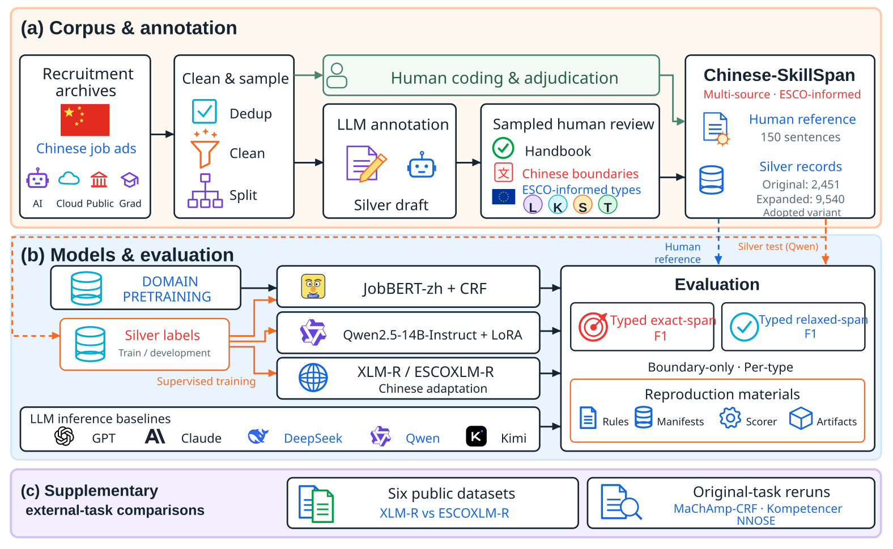

# Chinese-SkillSpan

The [resource naming guide](docs/terminology.md) distinguishes annotation pools, experimental splits, and human review samples. Current names describe their use; archived identifiers remain unchanged.

[Annotation roles and blinded-sample membership](reproduction/reviewer_supplement_20261004/README.md) clarify which results use human references and which use generated targets.

The [4 October revision and checks](reproduction/major_revision_20261004/README.md) update the current manuscript, data accounting, source-document analysis and uncertainty estimates. Earlier experiments remain archived.

A benchmark for competency span extraction in Chinese job advertisements, with annotation guidelines, Silver supervision, a human reference set, and evaluation tools.

Current manuscript: **Chinese-SkillSpan: a benchmark for competency span extraction in Chinese job advertisements**. [Read the manuscript and revision notes](reproduction/manuscript_revision_20261002/README.md).

**[Data and access](DATA_AVAILABILITY.md) · [Reproduce results](REPRODUCIBILITY.md) · [Models](docs/models.md) · [Paper-to-file index](reproduction/PAPER_INDEX.md)**

## What is included?

| Component | Size | Use |
|---|---:|---|
| Source corpus | 22,840 sentences | Four recruitment collections |
| Human reference set | 150 sentences, 663 spans | Frozen targets used in guideline development; diagnostic model evaluation |
| Original Silver pool | 2,451 records | Candidate supervision; experiment-specific inclusion |
| Silver training/development sets (Qwen and encoders) | 2,150 training / 169 development | Matched Qwen adaptation and encoder comparison |
| Silver training/development sets (JobBERT) | 2,156 training / 169 development | JobBERT-zh + CRF training and checkpoint selection |
| Expanded Silver pool (adopted Codex) | 9,540 records | Includes earlier supervision; complete partitions are not publicly released |
| Alternative expanded Silver pool | 9,646 records | Overlapping supplementary configuration; complete partitions are not publicly released |
| Historical human coding and review | 500 unique sentences | Reference construction and quality checks; not 500 Gold test sentences |
| Blinded agreement sample | 50 sentences; three annotators | Final-handbook agreement; separate from historical coverage and not a model test set |

Terminology follows the [annotation and training guide](docs/terminology.md). Manuscript numbers follow the [display-precision policy](docs/numerical_precision.md); source result files retain their original precision.

The task uses flat character spans with four types: language (L), knowledge-related requirements (K), occupational skills (S), and transversal competencies (T). The categories are ESCO-informed; the task does not assign ESCO concept IDs.

The authors confirm that the adopted Silver labels were generated through official OpenAI Codex, with the original annotation model recorded as `gpt-6-astra`. The alternative expanded annotation pool is retained only for supplementary comparison. DeepSeek and Kimi used official provider APIs. API baseline predictions were evaluated under a frozen protocol and checked by offline rescoring; recorded identifiers and access routes are listed in the [resource naming guide](PAPER_NAMES.md).

## Get started

1. **Use the data:** download the [v0.1.3 archive](https://doi.org/10.5281/zenodo.22698504), then read the [human-reference guide](data/gold150/README.md) and [annotation handbook](notes/handbooks/handbook_B_sop_v4.md).
2. **Inspect results:** open the [paper-to-file index](reproduction/PAPER_INDEX.md). It separates shared-guideline inference, supervised adaptation, and expanded-Silver experiments.
3. **Reproduce a score:** follow the [evaluation guide](reproduction/EVALUATION_ENTRY.md) with the matching protocol and saved predictions.
4. **Use a model:** see the [model guide](docs/models.md). The encoder and CRF checkpoint have separate loading requirements.

## Main adaptation result and supervised baseline

| Study | Comparison | Typed exact F1 on the human reference |
|---|---|---:|
| Qwen adaptation | No adapter → Qwen + LoRA | 0.3612 → 0.5403 ± 0.0354 |
| Silver-trained JobBERT baseline | JobBERT-zh + CRF; 2,156/169 training/development records | 0.5536 ± 0.0054 |

Training summaries are means and sample standard deviations across seeds 42, 43, and 44. The Qwen contrast uses fixed inference rules; the JobBERT row is the current supervised baseline. The full [historical JobBERT label-version comparison](reproduction/experimental_notes/jobbert_label_versions.md) remains available, including both scores and the changes to training and checkpoint-selection labels. Expanded-pool results and their access requirements are listed in the [expanded-study guide](reproduction/expanded_silver/README.md).

## Downloads and models

| Resource | Entry |
|---|---|
| Versioned data archive | [Zenodo v0.1.3](https://doi.org/10.5281/zenodo.22698504) |
| Qwen LoRA adapters and frozen predictions | [Qwen model-reproduction archive](https://doi.org/10.5281/zenodo.22851581) |
| Repository archive series | [Zenodo concept DOI](https://doi.org/10.5281/zenodo.22288337) |
| JobBERT-zh initialization | [Hugging Face model](https://huggingface.co/AlfredJames/jobbert-zh) |
| Silver-trained JobBERT-zh + CRF | [Hugging Face model](https://huggingface.co/AlfredJames/jobbert-zh-v6a) |
| Chinese-supervised XLM-R-large and ESCOXLM-R | [Model guide: three seeds per encoder](docs/models.md) · [Current audit archive](https://doi.org/10.5281/zenodo.22942441) |

Use the version-specific dataset DOI above for v0.1.3. The repository concept DOI currently resolves to the `qwen-repro-pack-20260919` snapshot, not the v0.1.3 dataset record. The archive covers the earlier released benchmark components. Later expansion materials on GitHub are partial; complete expanded training partitions are not supplied. Qwen adapters and frozen predictions are available in the separate model-reproduction archive. [Availability and licensing](DATA_AVAILABILITY.md) describes what readers can obtain and reuse.

## Citation

Use the metadata in [CITATION.cff](CITATION.cff) and cite [Zenodo v0.1.3](https://doi.org/10.5281/zenodo.22698504) for that archived dataset version. This citation identifies the archived dataset version, whose release title is retained. The current manuscript title, PDF, and source revision are available in the [manuscript directory](reproduction/manuscript_revision_20261002/README.md).

Related English resource: Zhang et al. (2022), [SkillSpan](https://aclanthology.org/2022.naacl-main.366/).

## Responsible use

This resource supports analysis of recruitment text, not measurement or profiling of individual applicants. The selected human reference is not a random population sample. Source wording has separate reuse conditions from the software; see [LICENSE](LICENSE) and [data access](DATA_AVAILABILITY.md).

Supported by the National Social Science Fund of China, Grant No. 21BGL142.

Data provenance: [data sources and collection](docs/data_sources.md).
